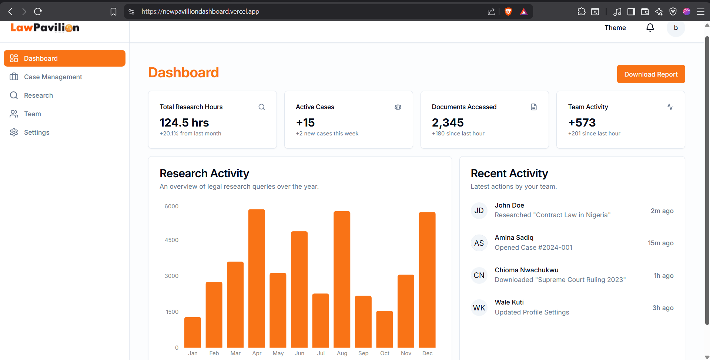

# LawPavillion Dashboard

A modern, production-grade SaaS dashboard built with **Next.js 15**, **React 19**, **Tailwind CSS**, and **Shadcn UI**.



## Features

- ⚡ **Performance**: Highly optimized with lazy loading and skeleton states for a smooth user experience.
- 🎨 **Themeable**: Dark/Light mode support with persistent state.
- 📱 **Responsive**: Fully responsive sidebar and layout for mobile and desktop.
- 🔒 **Secure**: Authentication powered by Auth.js (NextAuth v5).
- 📊 **Data Viz**: Integrated charts using Recharts.

## Tech Stack

- **Framework**: Next.js 15 (App Router)
- **Language**: TypeScript
- **Styling**: Tailwind CSS
- **UI Architecture**: Shadcn UI (Radix Primitives)
- **State Management**: React Suspense & Server Components
- **Database**: MongoDB (via Mongoose)

## Prerequisites

- Node.js 18+ installed
- MongoDB instance (local or Atlas)

## Getting Started

1.  **Clone the repository:**
    ```bash
    git clone https://github.com/your-repo/pavillion-dashboard.git
    cd pavillion-dashboard
    ```

2.  **Install dependencies:**
    ```bash
    npm install
    # or
    pnpm install
    # or
    yarn install
    ```

3.  **Environment Setup:**
    Create a `.env` file in the root directory and add the following variables:

    ```env
    # Authentication (Auth.js)
    AUTH_SECRET="your_generated_secret_here" # run `npx auth secret` to generate
    AUTH_URL="http://localhost:3000" # for local development

    # Database
    MONGODB_URI="mongodb://localhost:27017/lawpavillion" # or your Atlas connection string
    ```

4.  **Run the development server:**
    ```bash
    npm run dev
    ```

    Open [http://localhost:3000](http://localhost:3000) to view it in your browser.

## Project Structure

- `app/`: Next.js App Router pages and layouts.
- `components/`: Reusable UI components.
  - `ui/`: Shadcn UI primitives.
  - `dashboard-content.tsx`: Main dashboard logic (lazy loaded).
  - `sidebar.tsx`: Responsive navigation sidebar.
- `lib/`: Utility functions and database connections.
- `public/`: Static assets (logos, images).

## Key Implementation Details

### Hybrid Loading Strategy
The dashboard uses a hybrid approach to ensure optimal perceived performance:
- **Sidebar**: Renders statically on desktop (SSR) to prevent layout shift, while the interactive mobile menu hydrates on the client.
- **Dashboard Content**: Lazy loaded heavily using a custom `DashboardClientWrapper` to show immediate skeleton loading states, forcing a visible feedback loop for the user.
